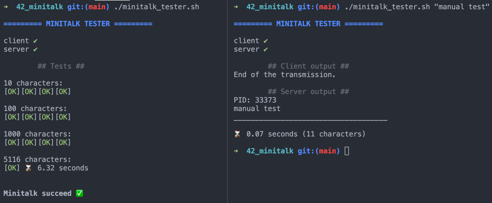

# MINITALK (@42Paris)

## Objective

The objective of this project is to code a small data exchange program using UNIX signals.

## Usage

```
$ git clone https://github.com/adbenoit-9/42_minitalk.git
$ cd 42_minitalk/
$ make
```

### Execution

```
$ ./server
PID: [PID]

(wait)
```
```
$ ./client [PID] [string to send]
```

## Tester

- if the string passed to the client has been correctly displayed by the server
- the speed of the transmission

```
$ cd tester/
$ ./minitalk_tester
        or
$ ./minitalk_tester [string to send]
```

### Preview

